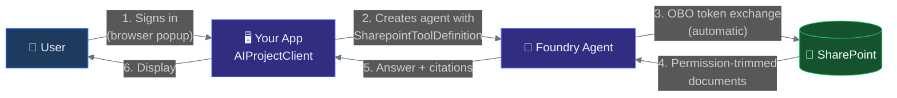
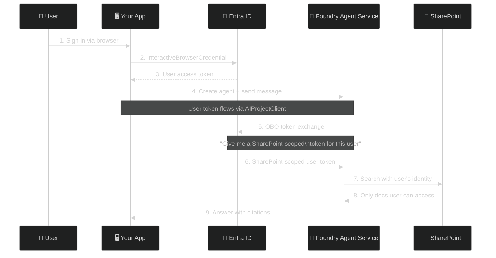
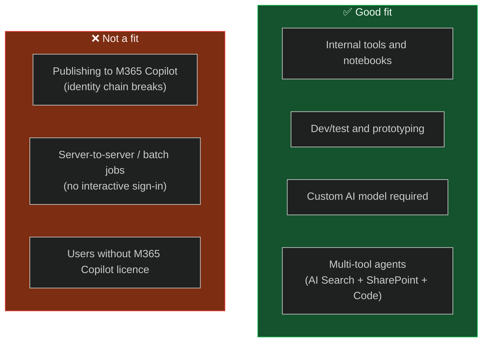

# Pattern 1: Foundry Agent with Native SharePoint Tool

> **Approach:** Use the built-in `SharepointToolDefinition` in Azure AI Foundry. The SDK handles OBO token exchange automatically — you write zero auth code for SharePoint.

---

## How It Works



## OBO Token Flow (Under the Hood)



**The key insight:** You never touch SharePoint APIs, Graph tokens, or OBO logic. The `SharepointToolDefinition` handles all of it inside the Foundry service.

---

## Prerequisites

| Requirement | Details |
|---|---|
| Azure AI Foundry project | [Create at ai.azure.com](https://ai.azure.com) |
| M365 Copilot licence | On the user account — required for SharePoint grounding |
| SharePoint connection | Configured in Foundry project (see setup) |
| Azure AD app registration | Public client for interactive sign-in |
| Python 3.9+ | `pip install azure-ai-projects azure-identity` |

---

## Setup

### 1. Create Azure AD App Registration

```
Azure Portal → App registrations → + New registration
├── Name: "Foundry SharePoint Sample"
├── Account type: Single tenant
├── Redirect URI: http://localhost (Mobile/desktop)
└── Note: Client ID + Tenant ID
```

### 2. Create SharePoint Connection in Foundry

```
ai.azure.com → Your Project → Settings → Connected resources
├── + New connection → SharePoint
├── Authenticate with an M365 account
└── Note the Connection ID
```

> **Connection ID format:** `/subscriptions/<sub>/resourceGroups/<rg>/providers/Microsoft.CognitiveServices/accounts/<acct>/projects/<proj>/connections/<name>`

### 3. Configure & Run

```bash
cp .env.example .env
# Fill in your values

pip install -r requirements.txt
python main.py
# → Browser opens for sign-in
# → Agent queries SharePoint and prints results
```

---

## When to Use This Pattern



---

## Limitations

- **Cannot publish to M365 Copilot** — when surfaced through M365 Copilot (Teams), the user token doesn't flow through the M365 → Foundry boundary. Use [Pattern 3](../03-declarative-agent-manifest/) for M365 deployment.
- **Interactive sign-in required** — the user must authenticate via browser. No headless/service token scenario.
- **M365 Copilot licence required** — SharePoint tool returns empty results without it.
- **Project-level connection** — all agents in the same Foundry project share the SharePoint connection.

---

## Files

| File | Description |
|---|---|
| `main.py` | Complete working example — agent creation, query, response |
| `.env.example` | Environment variable template |
| `requirements.txt` | `azure-ai-projects`, `azure-identity` |
