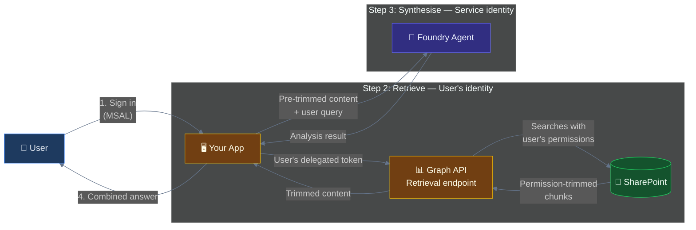
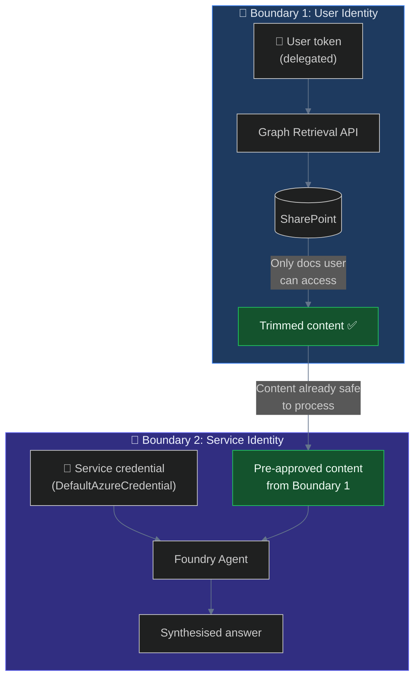
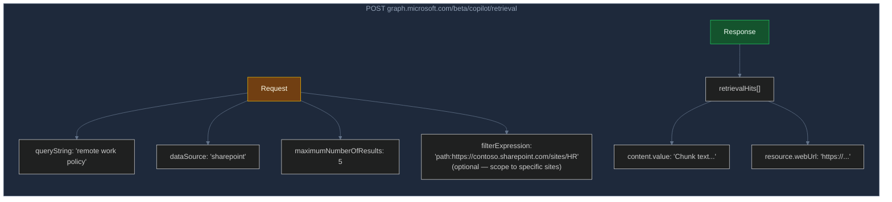
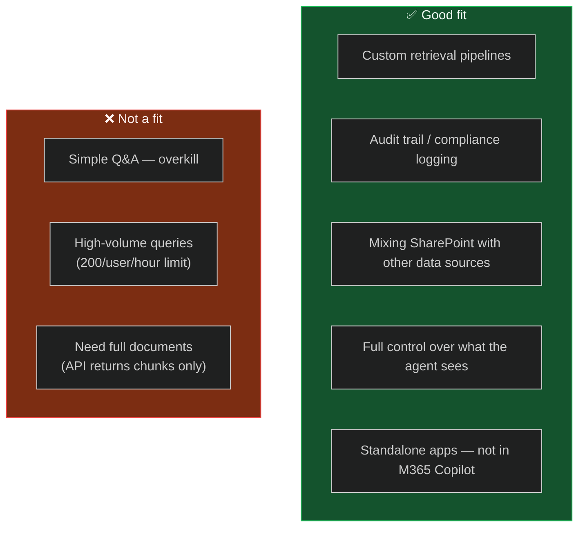

# Pattern 2: M365 Copilot Retrieval API + Foundry Agent

> **Approach:** You control the full pipeline. Acquire the user's token, call the Graph Retrieval API for permission-trimmed SharePoint content, then feed it to a Foundry agent for synthesis. Maximum control, maximum auditability.

---

## How It Works



## The Trust Model

Two identity boundaries keep the system secure:



**Why two boundaries?**
- **Boundary 1** ensures SharePoint enforces the user's permissions *before* content reaches your code
- **Boundary 2** lets Foundry process content without needing the user's token — it's already been vetted
- **Your app** is the bridge — it sees trimmed content, logs it if needed, and forwards to Foundry

---

## Prerequisites

| Requirement | Details |
|---|---|
| Azure AI Foundry project | With a pre-created agent (note the agent ID) |
| M365 Copilot licence | Or pay-as-you-go Copilot metering on the tenant |
| Azure AD app registration | Public client with delegated `Files.Read.All` + `Sites.Read.All` |
| Python 3.9+ | `pip install azure-ai-projects azure-identity msal requests` |

---

## Setup

### 1. Create Azure AD App Registration (Public Client)

```
Azure Portal → App registrations → + New registration
├── Name: "Foundry Retrieval Sample"
├── Account type: Single tenant
├── Redirect URI: http://localhost (Mobile/desktop)
├── Authentication → Allow public client flows: Yes
└── API permissions:
    ├── Microsoft Graph → Delegated → Files.Read.All
    └── Microsoft Graph → Delegated → Sites.Read.All
```

> **Admin consent:** Required for org-wide use. Individual user consent works for testing.

### 2. Create a Foundry Agent

Create an agent in your project (portal or SDK) and note its ID: `asst_xxxxxxxxxxxxxxxxxxxx`

### 3. Configure & Run

```bash
cp .env.example .env
# Fill in your values

pip install -r requirements.txt
python main.py
# → Browser opens for MSAL sign-in
# → Retrieval API returns SharePoint chunks
# → Foundry agent synthesises the answer
```

---

## Retrieval API Reference



| Constraint | Value |
|---|---|
| **Endpoint** | `POST https://graph.microsoft.com/beta/copilot/retrieval` |
| **Auth** | Delegated user token (OBO) |
| **Rate limit** | 200 requests / user / hour |
| **Data sources** | `sharepoint`, `onedrive`, `teams` |
| **Returns** | Text chunks (not full documents) |
| **Status** | Beta — may change |

---

## When to Use This Pattern



---

## Limitations

- **Beta API** — the Retrieval API is `beta` and subject to change
- **Rate limited** — 200 requests per user per hour; not suitable for high-frequency polling
- **Chunked results** — returns text snippets, not full documents
- **Interactive sign-in** — user must authenticate via browser (or you manage refresh tokens)
- **Two auth systems** — you manage MSAL for Graph *and* DefaultAzureCredential for Foundry

---

## Files

| File | Description |
|---|---|
| `main.py` | Complete pipeline: MSAL → Retrieval API → Foundry agent |
| `.env.example` | Environment variable template |
| `requirements.txt` | `azure-ai-projects`, `azure-identity`, `msal`, `requests` |
