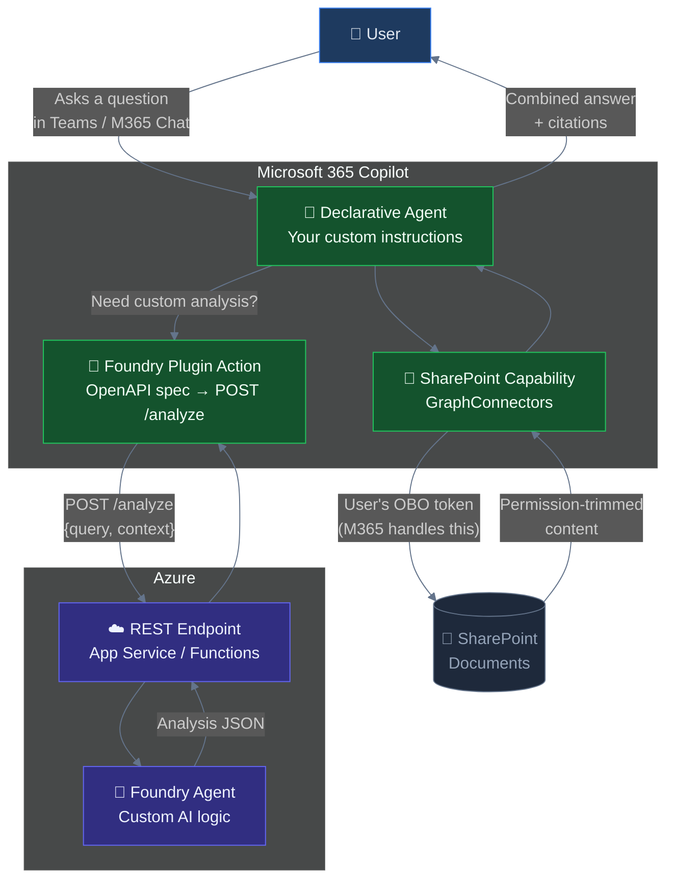
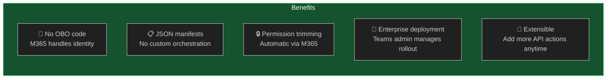
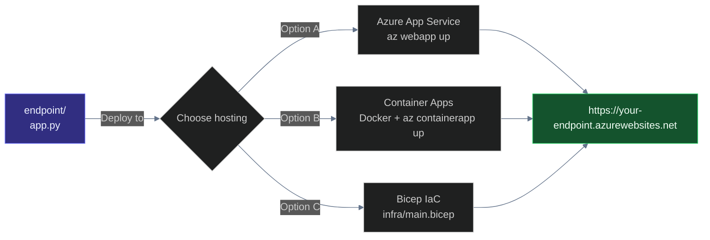
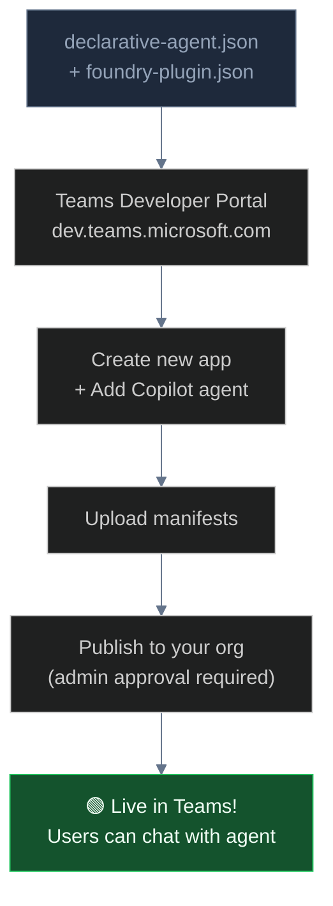
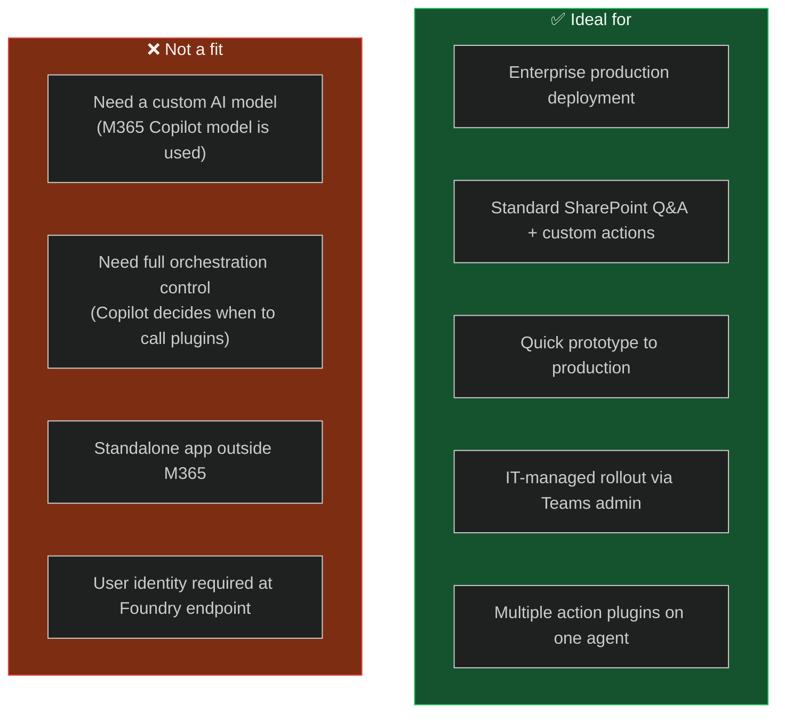

# Pattern 3: Declarative Agent + Foundry API Plugin ⭐

> **Approach:** Build a declarative agent in M365 Copilot that handles SharePoint natively and calls your Foundry agent as an API plugin. Zero OBO code. Lowest complexity. Enterprise-ready.

---

## How It Works



---

## Why This Pattern?



---

## Authentication Flow

```mermaid
%%{init: {'theme': 'dark', 'themeVariables': {'primaryColor': '#1e3a5f', 'primaryTextColor': '#e2e8f0', 'primaryBorderColor': '#3b82f6', 'lineColor': '#64748b'}}}%%
sequenceDiagram
    participant U as 👤 User (Teams)
    participant DA as 🤖 Declarative Agent
    participant M365 as 🔐 M365 Copilot
    participant SP as 📄 SharePoint
    participant Plugin as 🔌 Foundry Plugin
    participant FA as 🤖 Foundry Agent

    U->>DA: "What does our remote work policy say?"

    rect rgb(20, 83, 45)
        Note over DA,SP: OBO — handled entirely by M365
        DA->>M365: Trigger SharePoint search
        M365->>SP: User's delegated token (OBO)
        SP-->>M365: Docs the user can access ✅
        M365-->>DA: Permission-trimmed content
    end

    rect rgb(49, 46, 129)
        Note over DA,FA: Plugin — service-to-service
        DA->>Plugin: POST /analyze {query, context}
        Plugin->>FA: Forward to Foundry agent
        FA-->>Plugin: Analysis result
        Plugin-->>DA: JSON response
    end

    DA-->>U: "Our remote work policy states..."<br/>📎 Source: HR-Policy-2025.docx
```



> **You write no auth code.** M365 Copilot handles the OBO exchange for SharePoint. Your Foundry endpoint receives a service-to-service call — no user token needed.

---

## Prerequisites

| Requirement | Details | Notes |
|---|---|---|
| M365 Copilot licence | Required per user | Standard M365 Copilot |
| Azure AI Foundry project | Any tier | Pre-create an agent, note its ID |
| Azure hosting | App Service, Container Apps, or Functions | For the `/analyze` endpoint |
| Teams Developer Portal | [dev.teams.microsoft.com](https://dev.teams.microsoft.com) | To deploy the agent |
| Entra app registration | For plugin endpoint auth | Client credentials flow |

---

## Files

```
manifest/
├── declarative-agent.json     ← Agent manifest (instructions, capabilities, actions)
├── foundry-plugin.json        ← API plugin manifest (v2.2 format with OAuth)
├── openapi.json               ← OpenAPI 3.0 spec (/analyze + /health, with auth)
└── app-manifest.json          ← Teams app package manifest

endpoint/
├── app.py                     ← Production Flask endpoint with validation + logging
├── auth.py                    ← Entra ID bearer token validation
├── foundry_client.py          ← Foundry agent thread lifecycle management
├── .env.example               ← Environment variable template
├── requirements.txt           ← Python dependencies
└── Dockerfile                 ← Container build for Azure Container Apps

infra/
└── main.bicep                 ← Azure infra (App Service Plan + App Service + identity)

tests/
└── test_endpoint.py           ← Pytest tests with mocked Foundry calls
```

> 📖 See **[WALKTHROUGH.md](WALKTHROUGH.md)** for a complete step-by-step implementation guide.

---

## Manifest Walkthrough

### `manifest/declarative-agent.json`

Key fields:
- **`instructions`** — detailed rules telling Copilot when to search SharePoint vs call the Foundry plugin (e.g., comparisons, compliance checks)
- **`capabilities`** — `OneDriveAndSharePoint` for native document access + `GraphConnectors` for connector grounding
- **`actions`** — references `foundry-plugin.json` which contains the API plugin manifest
- **`conversation_starters`** — sample prompts shown to users

### `manifest/foundry-plugin.json` (API Plugin Manifest v2.2)

This is the **plugin manifest** (not the OpenAPI spec). Key fields:
- **`schema_version`**: `v2.2`
- **`runtimes`** → `auth` → `OAuthPluginVault` with your Teams Developer Portal OAuth registration ID
- **`functions`** — describes `analyzeContent` with a confirmation dialog

### `manifest/openapi.json` (OpenAPI 3.0 Spec)

Describes the REST API that backs the plugin:
- **`/analyze`** — POST with OAuth2 security, `query` + `context` (required) + `user_display_name` (optional)
- **`/health`** — GET, no auth, for App Service health probes
- **Error responses** — 400, 401, 500 with structured error schema
- **`x-openai-isConsequential: false`** — tells Copilot this is a read-only operation

---

## Setup

### Step 1: Deploy the Foundry Endpoint



**Azure App Service (quickest):**
```bash
cd endpoint

az webapp up \
  --name your-foundry-endpoint \
  --runtime PYTHON:3.11 \
  --sku B1

az webapp config appsettings set \
  --name your-foundry-endpoint \
  --settings \
    FOUNDRY_PROJECT_ENDPOINT="https://<acct>.services.ai.azure.com/api/projects/<proj>" \
    FOUNDRY_AGENT_ID="asst_xxxxxxxxxxxxxxxxxxxx" \
    AZURE_TENANT_ID="<tenant-id>" \
    AZURE_CLIENT_ID="<client-id>" \
    USE_MANAGED_IDENTITY="true"
```

> 📖 See **[WALKTHROUGH.md](WALKTHROUGH.md)** for Bicep and Container Apps deployment options.

### Step 2: Update Plugin URL

In `manifest/openapi.json`, replace the server URL:
```json
"servers": [
  { "url": "https://your-foundry-endpoint.azurewebsites.net" }
]
```

### Step 3: Deploy the Declarative Agent



**Via Teams Developer Portal:**
1. Go to [dev.teams.microsoft.com](https://dev.teams.microsoft.com)
2. Create a new app → **Copilot agents** → Add declarative agent
3. Upload manifests from the `manifest/` directory
4. Publish to your organisation (requires Teams admin approval)

**Via Teams Toolkit (VS Code):**
1. Create a new Teams app project
2. Replace generated manifests with these files
3. Deploy using the Teams Toolkit sidebar → Publish to organization

### Step 4: Test

1. Open **Teams** or **M365 Chat**
2. Start a conversation with the "HR Policy Assistant"
3. Ask: *"What does our remote work policy say about working from another country?"*
4. The agent searches SharePoint → optionally calls Foundry plugin → returns answer with citations

---

## Customisation

### Scope SharePoint to specific sites

```json
"capabilities": [
  {
    "name": "GraphConnectors",
    "connections": [
      {
        "connection_id": "sharepoint",
        "sites": ["https://contoso.sharepoint.com/sites/HR"]
      }
    ]
  }
]
```

### Add more Foundry actions

```json
"actions": [
  { "id": "foundryAnalysis", "file": "foundry-plugin.json" },
  { "id": "documentSummary", "file": "summary-plugin.json" },
  { "id": "complianceCheck", "file": "compliance-plugin.json" }
]
```

### Pass user context to Foundry

M365 Copilot doesn't pass the user's identity to plugin endpoints. To include user context, add it in the agent instructions:

```json
"instructions": "When calling FoundryAnalysis, always include the user's 
                  display name and department from the conversation context."
```

---

## When to Use This Pattern



---

## Limitations

| Limitation | Impact |
|---|---|
| **M365 Copilot only** | Users must be in Teams or M365 Chat |
| **M365 model used** | You can't use a fine-tuned or specific Foundry model for the main orchestration |
| **Copilot controls orchestration** | It decides when to search SharePoint vs. call your plugin |
| **No user identity at endpoint** | Your Foundry endpoint gets a service call, not the user's token |
| **Manifest schema evolving** | Check latest docs — the declarative agent schema may change |
| **Admin approval required** | Publishing to an org needs Teams admin sign-off |

---

## References

| Resource | Link |
|---|---|
| Declarative Agents | <https://learn.microsoft.com/microsoft-365-copilot/extensibility/overview-declarative-agent> |
| API Plugins | <https://learn.microsoft.com/microsoft-365-copilot/extensibility/overview-api-plugins> |
| Teams Developer Portal | <https://dev.teams.microsoft.com> |
| Teams Toolkit | <https://learn.microsoft.com/microsoftteams/platform/toolkit/teams-toolkit-fundamentals> |
| azure-ai-projects SDK | <https://pypi.org/project/azure-ai-projects/> |
