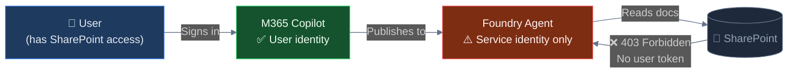
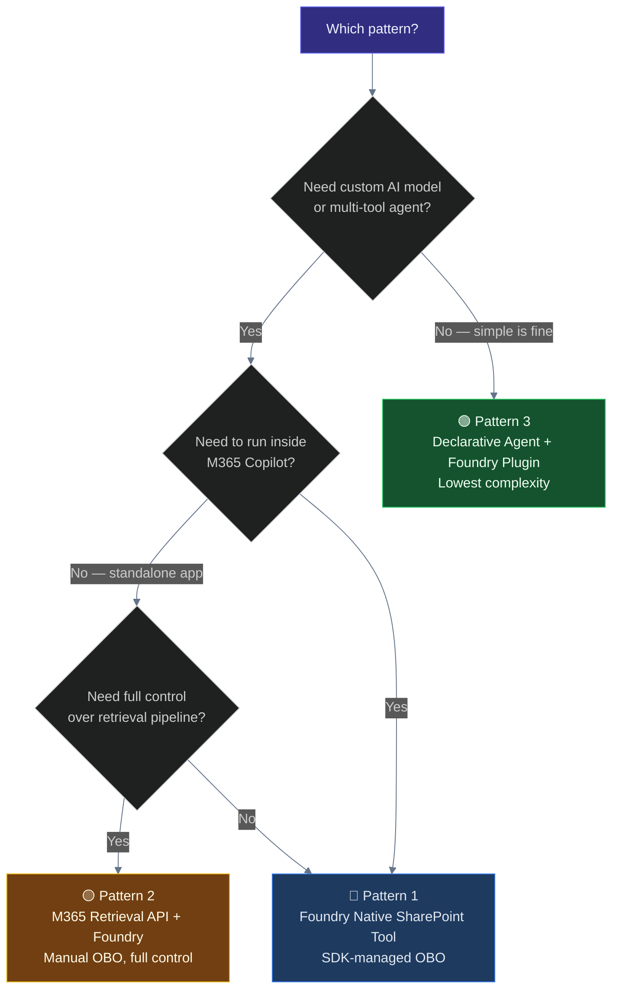

# Azure AI Foundry + SharePoint: Identity Passthrough Patterns

> Three integration patterns for connecting Azure AI Foundry agents to SharePoint with proper **On-Behalf-Of (OBO)** user identity — so document permissions are always enforced.

---

## The Problem

SharePoint requires a **delegated user token** to enforce document permissions. Azure AI Foundry agents operate under a **service identity**. When these two meet, the identity chain breaks:



Each pattern in this repo solves this gap differently.

---

## Three Patterns at a Glance



| | Pattern 1 | Pattern 2 | Pattern 3 |
|---|---|---|---|
| **Name** | Foundry Native SharePoint Tool | M365 Retrieval API + Foundry | Declarative Agent + Foundry Plugin |
| **OBO handled by** | Foundry SDK (automatic) | Your code (MSAL + Graph) | M365 Copilot (automatic) |
| **Runs where** | Standalone app / notebook | Standalone app | Inside M365 Copilot (Teams) |
| **Custom AI model** | ✅ Yes — full Foundry | ✅ Yes — full Foundry | ⚠️ Limited — M365 model + Foundry action |
| **Orchestration control** | Medium | Full | Low (M365 Copilot decides) |
| **Complexity** | Medium | High | **Low** |
| **M365 Copilot licence** | Required | Required | Required |
| **Best for** | Dev/testing, internal tools | Custom pipelines, audit trails | Production enterprise rollout |

---

## Repository Structure

```
foundry-sharepoint-obo-sample/
│
├── 01-foundry-sharepoint-tool/          ← Pattern 1: SDK-managed OBO
│   ├── main.py                           ← Complete working example
│   ├── .env.example
│   ├── requirements.txt
│   └── README.md                         ← Setup guide with Mermaid diagrams
│
├── 02-m365-retrieval-api/               ← Pattern 2: Manual OBO via Graph
│   ├── main.py                           ← MSAL + Retrieval API + Foundry
│   ├── .env.example
│   ├── requirements.txt
│   └── README.md                         ← Trust model diagrams
│
├── 03-declarative-agent-manifest/       ← Pattern 3: M365 Copilot native ⭐
│   ├── declarative-agent.json            ← Agent manifest
│   ├── foundry-plugin.json               ← OpenAPI spec for Foundry endpoint
│   ├── stub-endpoint/
│   │   ├── app.py                        ← Flask endpoint calling Foundry
│   │   └── requirements.txt
│   └── README.md                         ← Full deployment guide
│
└── README.md                            ← This file
```

---

## Identity Flow Comparison

```mermaid
%%{init: {'theme': 'dark', 'themeVariables': {'primaryColor': '#1e3a5f', 'primaryTextColor': '#e2e8f0', 'primaryBorderColor': '#3b82f6', 'lineColor': '#64748b'}}}%%
sequenceDiagram
    participant U as 👤 User
    participant App as Application
    participant SP as 📄 SharePoint
    participant FA as 🤖 Foundry Agent

    rect rgb(30, 58, 95)
        Note over U,FA: Pattern 1 — Foundry SDK handles OBO
        U->>App: Sign in (browser)
        App->>FA: User token → AIProjectClient
        FA->>SP: OBO exchange (automatic)
        SP-->>FA: Permission-trimmed docs
        FA-->>App: Answer + citations
    end

    rect rgb(113, 63, 18)
        Note over U,FA: Pattern 2 — You control the pipeline
        U->>App: Sign in (MSAL)
        App->>SP: User token → Graph Retrieval API
        SP-->>App: Permission-trimmed chunks
        App->>FA: Service token + pre-trimmed content
        FA-->>App: Synthesised answer
    end

    rect rgb(20, 83, 45)
        Note over U,FA: Pattern 3 — M365 Copilot handles everything
        U->>App: Ask question in Teams
        App->>SP: OBO (M365 Copilot internal)
        SP-->>App: Permission-trimmed results
        App->>FA: Plugin action (service-to-service)
        FA-->>App: Analysis result
        App-->>U: Combined answer
    end
```



---

## Prerequisites (All Patterns)

| Requirement | Details |
|---|---|
| **M365 Copilot licence** | Required per user — standard M365 Copilot |
| **Azure AI Foundry project** | [Create at ai.azure.com](https://ai.azure.com) — any tier |
| **Python 3.9+** | For patterns 1 and 2; pattern 3 needs Python only for the endpoint |
| **Azure subscription** | For Foundry resources and hosting |
| **SharePoint content** | Documents the agent should be able to search |

---

## Quick Links

| Resource | Link |
|---|---|
| Azure AI Foundry Portal | <https://ai.azure.com> |
| SharePoint Tool for Foundry Agents | <https://learn.microsoft.com/azure/foundry/agents/how-to/tools/sharepoint> |
| Declarative Agents Overview | <https://learn.microsoft.com/microsoft-365-copilot/extensibility/overview-declarative-agent> |
| API Plugins for M365 Copilot | <https://learn.microsoft.com/microsoft-365-copilot/extensibility/overview-api-plugins> |
| M365 Copilot Retrieval API | <https://learn.microsoft.com/graph/api/resources/copilot-retrieval> |
| azure-ai-projects Python SDK | <https://pypi.org/project/azure-ai-projects/> |
| Teams Developer Portal | <https://dev.teams.microsoft.com> |

---

*Azure AI Foundry · February 2026 · [Report issues](https://github.com/clark235/foundry-sharepoint-obo-sample/issues)*
