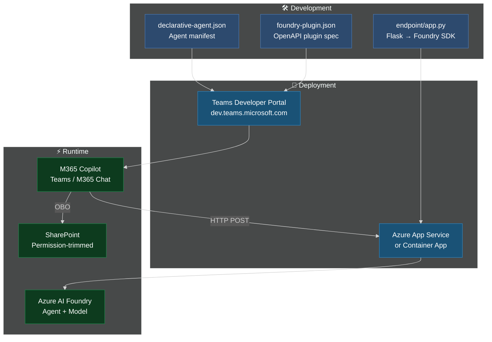
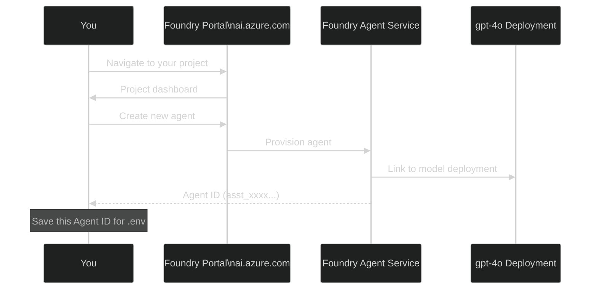
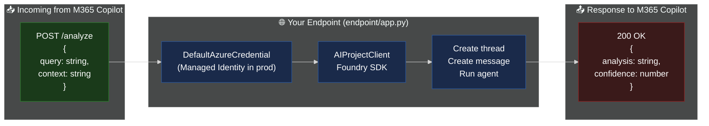
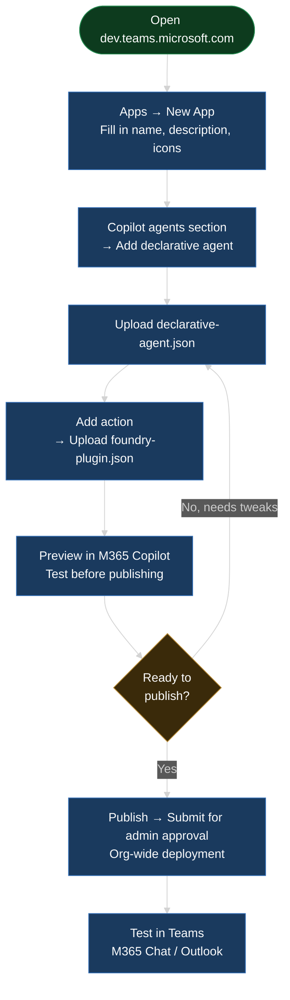
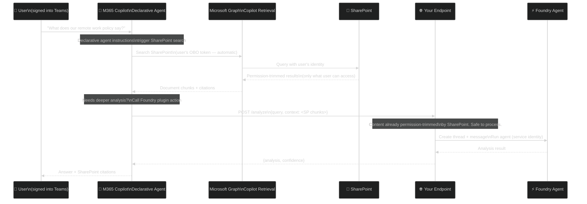
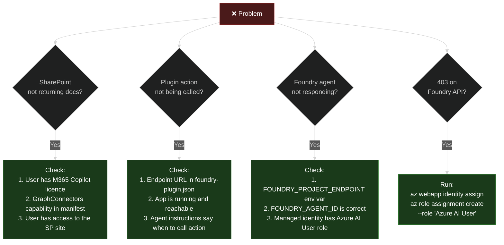

# Setup Guide — Declarative Agent with Foundry Plugin

## Architecture Overview



---

## Step 1 — Create an Azure AI Foundry Agent

Before deploying anything, create the Foundry agent that will power your plugin endpoint.



**In the Foundry portal:**
1. Go to [ai.azure.com](https://ai.azure.com) → your project
2. Click **Agents** → **New agent**
3. Select model: `gpt-4o` or `gpt-4.1`
4. Set instructions:
   ```
   You are an expert analyst. You will receive a user question and SharePoint document
   context retrieved by M365 Copilot. Provide a clear, structured analysis with
   specific references to the provided content.
   ```
5. Save and copy the **Agent ID** (`asst_xxxxxxxxxxxxxxxxxxxx`)

---

## Step 2 — Deploy the Plugin Endpoint

The endpoint is a lightweight Flask app that bridges M365 Copilot to your Foundry agent.



### Deploy to Azure App Service

```bash
cd endpoint

# Create App Service
az webapp up \
  --name your-foundry-plugin-endpoint \
  --runtime PYTHON:3.11 \
  --sku B2

# Set environment variables
az webapp config appsettings set \
  --name your-foundry-plugin-endpoint \
  --settings \
    FOUNDRY_PROJECT_ENDPOINT="https://<account>.services.ai.azure.com/api/projects/<project>" \
    FOUNDRY_AGENT_ID="asst_xxxxxxxxxxxxxxxxxxxx"

# Enable system-assigned managed identity (for production auth)
az webapp identity assign --name your-foundry-plugin-endpoint

# Grant the identity Azure AI User role on your Foundry account
PRINCIPAL_ID=$(az webapp identity show --name your-foundry-plugin-endpoint --query principalId -o tsv)
az role assignment create \
  --assignee $PRINCIPAL_ID \
  --role "Azure AI User" \
  --scope "/subscriptions/<sub>/resourceGroups/<rg>/providers/Microsoft.CognitiveServices/accounts/<account>"
```

### Update `foundry-plugin.json`

Replace the server URL with your deployed endpoint:
```json
"servers": [
  { "url": "https://your-foundry-plugin-endpoint.azurewebsites.net" }
]
```

---

## Step 3 — Register in Teams Developer Portal



**Steps:**
1. Go to [Teams Developer Portal](https://dev.teams.microsoft.com/)
2. **Apps** → **New App**
3. Fill in basic info (name: "HR Policy Assistant", description, icons)
4. Navigate to **Copilot agents** in the left sidebar
5. Click **Add a declarative agent** → upload `declarative-agent.json`
6. Under **Actions**, click **Add action** → upload `foundry-plugin.json`
7. Click **Preview in Copilot** to test
8. When ready: **Publish** → **Submit for admin approval**

---

## Step 4 — How OBO Works in This Pattern

You don't write any OBO code — M365 Copilot handles it entirely.



**Key points:**
- **You never see the user's token** — M365 Copilot handles the entire OBO exchange
- **Permission trimming is automatic** — SharePoint enforces the user's access before content leaves
- **Your endpoint uses a service identity** — Managed Identity for Foundry calls (not the user's identity)

---

## Step 5 — Customise the Manifest

### Restrict to specific SharePoint sites

```json
"capabilities": [
  {
    "name": "GraphConnectors",
    "connections": [
      {
        "connection_id": "sharepoint",
        "sites": [
          "https://contoso.sharepoint.com/sites/HR",
          "https://contoso.sharepoint.com/sites/Legal"
        ]
      }
    ]
  }
]
```

### Add multiple Foundry actions

```json
"actions": [
  { "id": "foundryAnalysis",   "file": "foundry-plugin.json" },
  { "id": "ticketCreation",    "file": "ticket-plugin.json"  },
  { "id": "complianceCheck",   "file": "compliance-plugin.json" }
]
```

### Tune agent instructions

```json
"instructions": "You help employees with HR and legal policy questions. Always search SharePoint first and cite specific documents. For comparisons between policies or industry benchmarks, use the FoundryAnalysis action — do not attempt comparisons yourself. Never guess at policy content; if uncertain, say so and suggest the user consult HR directly."
```

---

## Troubleshooting



---

## Security Considerations

| Layer | Control | Notes |
|---|---|---|
| User → M365 Copilot | M365 SSO | Standard enterprise auth |
| SharePoint access | OBO (automatic) | Permission-trimmed by Graph |
| M365 Copilot → Endpoint | HTTPS + optional API key | Add `securitySchemes` to OpenAPI spec for production |
| Endpoint → Foundry | Managed Identity | No secrets stored in code |
| Foundry Agent | Azure RBAC | Azure AI User role scoped to project |

> **Never** store credentials in `app.py` or environment variables in development. Use Azure Key Vault for production secrets and Managed Identity for all Azure service calls.

---

*Azure AI Foundry Team · March 2026*  
*Related: [Declarative Agents Docs](https://learn.microsoft.com/microsoft-365-copilot/extensibility/overview-declarative-agent) · [Foundry Agent Service](https://learn.microsoft.com/azure/ai-foundry/agents/overview)*
